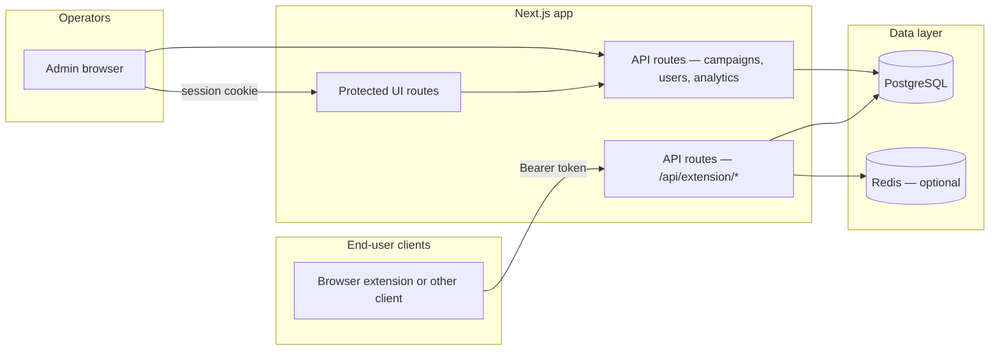
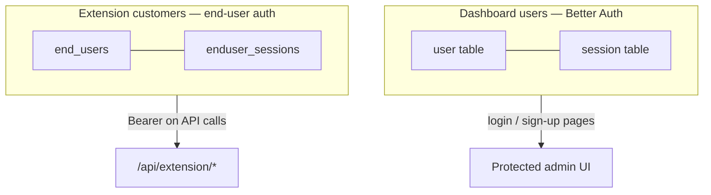
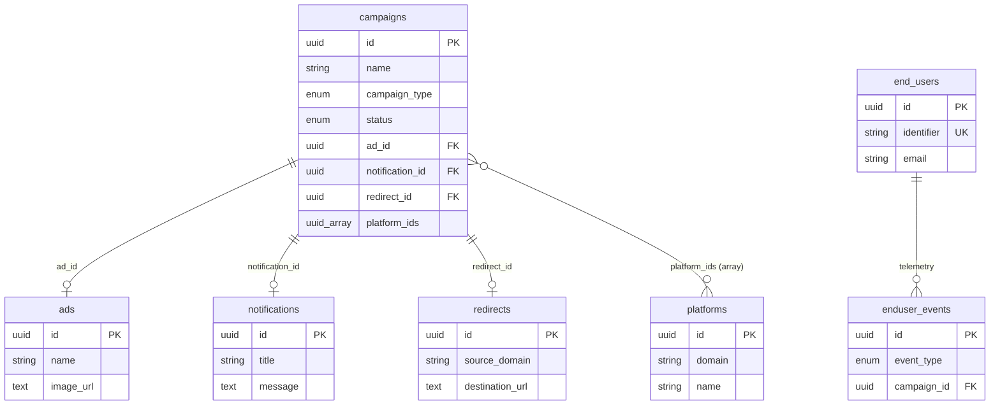

# Admin Dashboard

A **Next.js** admin application for operating a campaign-centric ads, notifications, and redirect platform. Operators manage **platforms**, **creatives**, and **campaigns**; **end users** (typically via a browser extension) receive targeted content and send telemetry back. The codebase is structured so new contributors can trace **who authenticates where**, **which APIs serve traffic**, and **how data lands in Postgres**.

This README is the **front door**: deeper behavior lives in [`docs/`](./docs/) and [`tests/README.md`](./tests/README.md).

**Maintainers:** whenever you change **architecture**, **auth**, **extension APIs**, **env vars**, **migrations/startup**, or **how to run/test** the app, open this file and update what’s affected—including **Mermaid diagrams** if the story they tell is no longer accurate. If you are unsure, default to a small README tweak so the next ten developers stay aligned.

---

## What you get

| Area | Stack |
|------|--------|
| App framework | [Next.js](https://nextjs.org/) (App Router) |
| UI | React, Tailwind CSS, [Radix UI](https://www.radix-ui.com/) primitives |
| Admin auth | [Better Auth](https://www.better-auth.com/) + Postgres |
| Extension auth | Bearer tokens + `end_users` / `enduser_sessions` (see [`src/lib/enduser-auth.ts`](./src/lib/enduser-auth.ts)) |
| Database | PostgreSQL, [Drizzle ORM](https://orm.drizzle.team/) ([`src/db/schema.ts`](./src/db/schema.ts)) |
| Realtime / cache (optional) | [Redis](https://redis.io/) — live SSE, rate limits, hot-path caches ([`src/lib/redis.ts`](./src/lib/redis.ts)) |
| Tests | [Vitest](https://vitest.dev/) |

---

## High-level architecture



**Mental model:** one deployment hosts both the **operator console** and the **extension-facing HTTP + SSE** surface. Only the path and credential differ.

---

## Two identities (do not confuse them)



| Concept | Tables / code | Used for |
|---------|----------------|----------|
| **Admin / operator** | `user`, `session`, … | Logging into the dashboard, managing campaigns |
| **End user** | `end_users`, `enduser_sessions` | Extension register/login, serve, events, live stream |

Campaign analytics and payments attach to **end users**, not to Better Auth `user` rows.

---

## Extension integration (v2)

**Current surface:** `GET /api/extension/live` (SSE), `POST /api/extension/serve`, and `POST /api/extension/events` (see the contract). The pre-v2 combined `POST /api/extension/ad-block` response is **removed** — do not call it. The sequence below is the intended mental model for new engineers and API researchers.

```mermaid
sequenceDiagram
  participant Client as Extension client
  participant Auth as /api/extension/auth/*
  participant Live as /api/extension/live (SSE)
  participant Serve as /api/extension/serve
  participant Events as /api/extension/events

  Client->>Auth: register or login
  Auth-->>Client: Bearer token
  Client->>Live: open SSE (token)
  Live-->>Client: init: user, domains, redirects
  Note over Client: Match redirects locally; navigate without blocking on HTTP
  Client->>Serve: domain + optional type (ads / popup / notification)
  Serve-->>Client: creatives (targeting applied server-side)
  Client->>Events: batch visit / notification / redirect telemetry
```

Authoritative contract: [`docs/EXTENSION_CLIENT_CONTRACT.md`](./docs/EXTENSION_CLIENT_CONTRACT.md).  
Migration notes from legacy: [`docs/EXTENSION_LEGACY_REMOVAL_MIGRATION.md`](./docs/EXTENSION_LEGACY_REMOVAL_MIGRATION.md).

---

## Domain model (simplified)

The schema is **campaign-centric**: each campaign has a single type (`ads`, `popup`, `notification`, or `redirect`) and references one creative row as appropriate. Platforms are attached at the campaign level (`platformIds`).



Full definitions and enums: [`src/db/schema.ts`](./src/db/schema.ts).

---

## Repository layout

```text
src/
  app/
    (protected)/          # Admin UI — requires Better Auth session
    api/                  # REST-style route handlers (admin + extension)
    login/  sign-up/      # Auth pages
  components/             # Shared UI  db/                     # Drizzle client + schema
  lib/                    # Auth helpers, extension handlers, dashboards, Redis, etc.
docs/                     # Deployment, extension contract, migration notes
tests/                    # Vitest — see tests/README.md
drizzle/                  # SQL migrations
scripts/                  # Seeds, maintenance, load tests
```

---

## Local development

**Prerequisites:** Node20+, [pnpm](https://pnpm.io/) 9+, PostgreSQL.

```bash
pnpm install
# Set env vars (see below), then:
pnpm db:migrate:app   # or drizzle migrate — see package.json scripts
pnpm dev
```

The dev server defaults to port **3000** (`pnpm dev`).

**First admin user:** with `ADMIN_EMAIL` and `ADMIN_PASSWORD` set in the environment, you can run `pnpm db:seed-admin` (see [`scripts/seed-admin.ts`](./scripts/seed-admin.ts)).

---

## Environment variables

Required values are validated at runtime via [`src/lib/config/env.ts`](./src/lib/config/env.ts).

| Variable | Required | Purpose |
|----------|----------|---------|
| `DATABASE_URL` | Yes | PostgreSQL connection string |
| `BETTER_AUTH_SECRET` | Yes | Min 32 characters |
| `BETTER_AUTH_BASE_URL` or `BETTER_AUTH_URL` | Production | Public URL of the app (no trailing slash) |
| `ADMIN_EMAIL` / `ADMIN_PASSWORD` | No | Optional seed for first admin |
| `REDIS_URL` | No | Recommended in production for realtime and rate limiting ([`docs/DEPLOY.md`](./docs/DEPLOY.md)) |

---

## Database migrations

On **Node server startup**, [`instrumentation.ts`](./instrumentation.ts) runs migrations ([`src/lib/db/run-migrate.ts`](./src/lib/db/run-migrate.ts)). You can also apply migrations manually with the `db:*` scripts in [`package.json`](./package.json).

---

## Testing

```bash
pnpm test              # Full suite
pnpm test:integration  # Extension HTTP + DB flows (opt-in)
```

Details and diagrams: [`tests/README.md`](./tests/README.md).

---

## CI

GitHub Actions (lint, build, test) is defined in [`.github/workflows/ci.yml`](./github/workflows/ci.yml).

---

## Documentation index

| Doc | Topic |
|-----|--------|
| [`docs/DEPLOY.md`](./docs/DEPLOY.md) | Vercel, Docker, env vars |
| [`docs/EXTENSION_CLIENT_CONTRACT.md`](./docs/EXTENSION_CLIENT_CONTRACT.md) | Extension API reference |
| [`docs/EXTENSION_LEGACY_REMOVAL_MIGRATION.md`](./docs/EXTENSION_LEGACY_REMOVAL_MIGRATION.md) | v2 vs removed legacy |
| [`tests/README.md`](./tests/README.md) | How tests are organized |

---

## Keeping this README current (future changes)

Treat README updates as part of the same change whenever you touch any of the following:

| Change | Usually update in README |
|--------|---------------------------|
| New service, data store, or deployment target | Stack table, architecture diagram, `docs/` links |
| Admin vs extension auth flow | “Two identities” section and any auth-related tables |
| Extension HTTP/SSE contract or bootstrap flow | Sequence diagram, links to `EXTENSION_CLIENT_CONTRACT.md` |
| Schema or domain concepts (campaigns, events, users) | ER diagram and short descriptions |
| New required env vars or scripts | Environment and Local development sections |
| CI commands or test layout | Testing and CI sections |

If the change is internal-only and invisible to onboarding, you may skip README edits—but when in doubt, **update the README in the same PR**.

---

## Contributing

Issues and pull requests are welcome. A few norms that keep review small and friendly:

1. Match existing patterns in `src/lib` and `src/components` before introducing new abstractions.
2. Extension behavior changes should update **`docs/EXTENSION_CLIENT_CONTRACT.md`** (and tests under `tests/` when applicable).
3. **Review this README** (and diagrams) when your PR changes architecture, APIs, env, or developer workflow—see [Keeping this README current](#keeping-this-readme-current-future-changes).
4. Run `pnpm lint`, `pnpm build`, and `pnpm test` before opening a PR.

If you are onboarding: read this README, skim **`src/db/schema.ts`**, then trace one admin flow (e.g. campaigns UI → API route) and one extension flow (`serve` → `enduser_events`). That path covers most of the product surface.

---

## License

License terms are not set in this repository yet. If you open-source the project, add a `LICENSE` file and reference it here.
