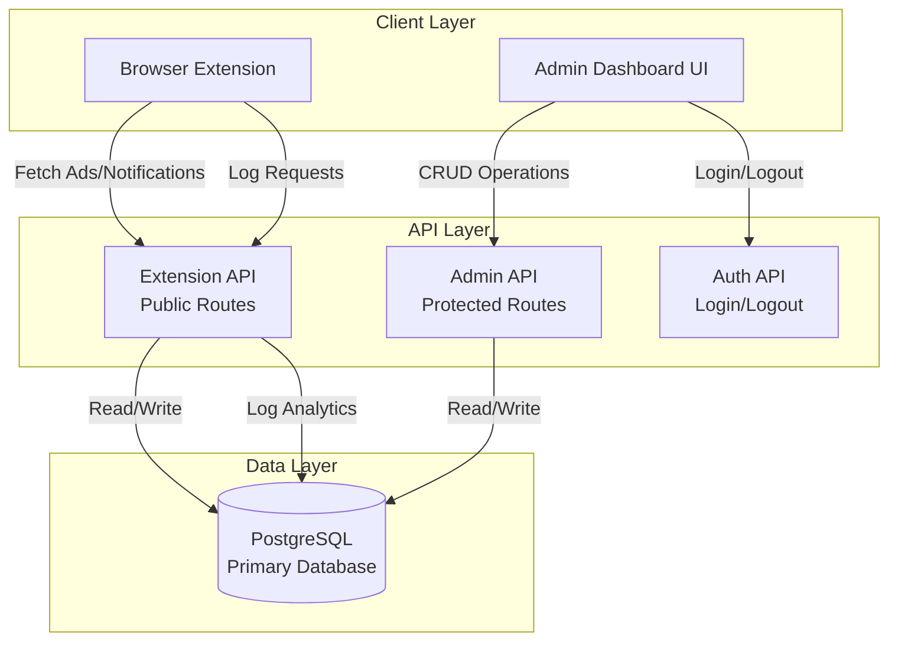
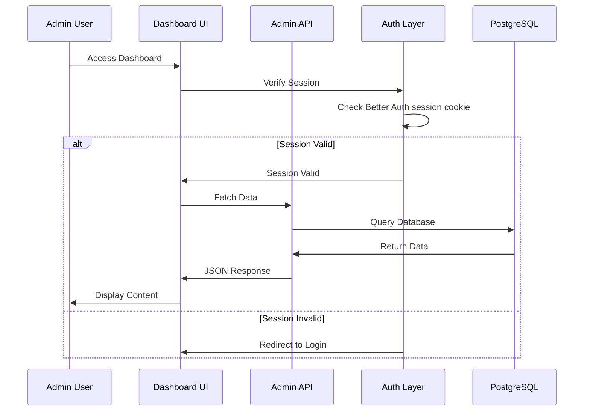
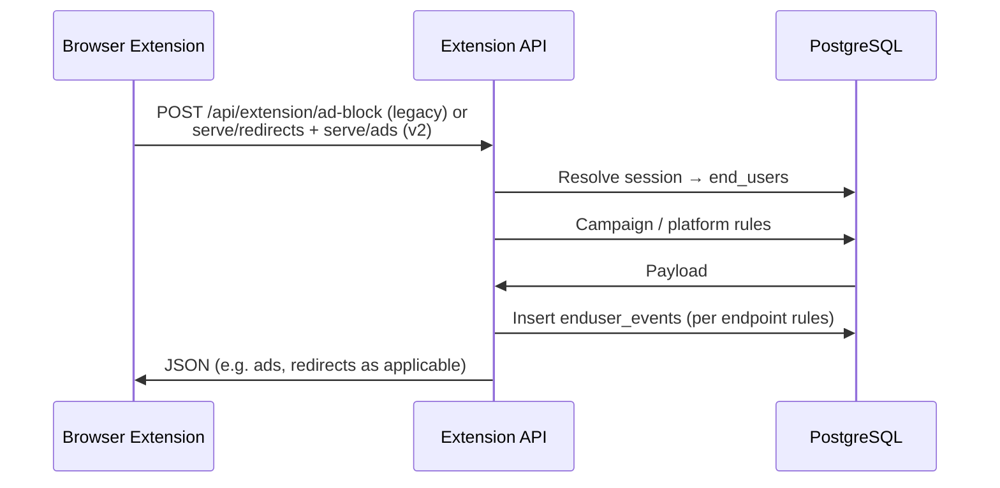

# System Architecture

## Overview

The Admin Dashboard is a Next.js 16 application that provides a complete backend and administrative interface for managing advertisements and notifications delivered via browser extensions. The system follows a three-tier architecture with clear separation between client, API, and data layers.

## High-Level Architecture


```mermaid
flowchart TB
    subgraph client [Client Layer]
        Browser[Browser Extension]
        AdminUI[Admin Dashboard UI]
    end
    
    subgraph api [API Layer]
        ExtAPI[Extension API<br/>Public Routes]
        AdminAPI[Admin API<br/>Protected Routes]
        AuthAPI[Auth API<br/>Login/Logout]
    end
    
    subgraph data [Data Layer]
        DB[(PostgreSQL<br/>Primary Database)]
    end
    
    Browser -->|Fetch Ads/Notifications| ExtAPI
    Browser -->|Log Requests| ExtAPI
    AdminUI -->|CRUD Operations| AdminAPI
    AdminUI -->|Login/Logout| AuthAPI
    
    ExtAPI -->|Read/Write| DB
    ExtAPI -->|Log Analytics| DB
    AdminAPI -->|Read/Write| DB
```

## Component Architecture

### Application Layers

#### 1. Client Layer
- **Browser Extension**: Consumes public Extension API
- **Admin Dashboard**: React-based UI for content management
- **Components**: Reusable UI components built with shadcn/ui

#### 2. API Layer
- **Extension API** (`/api/extension/ad-block`, `/api/extension/serve/ads`, `/api/extension/serve/redirects`, `/api/extension/events`, `/api/extension/live`, `/api/extension/auth/*`, `/api/extension/domains`)
  - **v2:** **`GET /api/extension/live`** (SSE) sends full `init` (platforms, campaigns, frequency) — auth via **`Authorization: Bearer`** or **`?token=`**
  - **`POST /api/extension/serve/ads`** — Bearer; per-visit **ads + popup**; logs `enduser_events` (`ad` / `popup`)
  - **`POST /api/extension/serve/redirects`** — Bearer; lists eligible redirect campaigns (date + frequency filters); does not log serves — client reports `redirect` via **`/events`**
  - **`POST /api/extension/events`** — Bearer; client-reported **notification** / **redirect** events
  - **Legacy `POST /api/extension/ad-block`** — Bearer; combined ads / notifications / redirects
  - **Redirects (v2):** prefetch **`POST /api/extension/serve/redirects`** (or SSE); match with **`domain_regex`** → navigate → **`POST /events`** (`redirect`). **Notifications:** match client-side from SSE; telemetry via **`events`** (or legacy ad-block for combined pulls)
  - **`GET /api/extension/domains`** — public list of platform domains (optional if using v2 `init`)
  
- **Admin API** (`/api/platforms`, `/api/ads`, `/api/notifications`, `/api/redirects`)
  - Protected endpoints (require authentication)
  - Full CRUD operations
  - Admin-only access

- **Auth API** (`/api/auth/*` — Better Auth)
  - Email/password sign-in and sign-out
  - Session stored in HTTP-only cookie (managed by Better Auth + Drizzle adapter)

#### 3. Data Layer
- **PostgreSQL**: Primary data store
  - Platforms, ads, notifications, campaigns
  - Extension end users (`end_users`, `enduser_sessions`, `enduser_events`, `payments`)
  - Better Auth tables for dashboard admins

## Request Flow

### Admin Dashboard Request Flow


```mermaid
sequenceDiagram
    participant Admin as Admin User
    participant UI as Dashboard UI
    participant API as Admin API
    participant Auth as Auth Layer
    participant DB as PostgreSQL
    
    Admin->>UI: Access Dashboard
    UI->>Auth: Verify Session
    Auth->>Auth: Check Better Auth session cookie
    alt Session Valid
        Auth->>UI: Session Valid
        UI->>API: Fetch Data
        API->>DB: Query Database
        DB->>API: Return Data
        API->>UI: JSON Response
        UI->>Admin: Display Content
    else Session Invalid
        Auth->>UI: Redirect to Login
    end
```

### Extension API Request Flow


```mermaid
sequenceDiagram
    participant Ext as Browser Extension
    participant API as Extension API
    participant DB as PostgreSQL
    
    Ext->>API: POST /api/extension/ad-block (legacy) or<br/>serve/redirects + serve/ads (v2)
    API->>DB: Resolve session → end_users
    API->>DB: Campaign / platform rules
    DB->>API: Payload
    API->>DB: Insert enduser_events (per endpoint rules)
    API->>Ext: JSON (e.g. ads, redirects as applicable)
```

## Data Flow

### Creating an Ad

1. **Admin Action**: Admin fills form in dashboard
2. **Client**: Form submission via POST to `/api/ads`
3. **API**: Validates input, checks authentication
4. **Database**: Inserts new ad record
5. **Response**: Returns created ad data
6. **Client**: Updates UI, redirects or shows success

### Extension fetching (v2 and legacy)

**v2 (recommended)**  
1. **Auth**: Bearer on **`/api/extension/live`** (SSE), **`/api/extension/serve/redirects`**, **`/api/extension/serve/ads`**, **`/api/extension/events`**.  
2. **Redirects**: `POST /api/extension/serve/redirects` — cached list with **`domain_regex`**, **`target_url`**, **`date_till`**, **`count`**; client matches host, then **`POST /events`** for **`redirect`** after navigation (no server log on prefetch).  
3. **Ads / popups**: `POST /api/extension/serve/ads` with `domain` — response `{ ads: [...] }`; server logs **`ad`** / **`popup`**.  
4. **Visits / notifications**: batched or immediate **`POST /api/extension/events`**.  
5. **Realtime**: SSE **`init`** and updates (`campaign_updated`, `frequency_updated`, …).

**Legacy `POST /api/extension/ad-block`**  
1. Extension sends Bearer + `domain` / optional `requestType`.  
2. Response `{ ads, notifications, redirects }`; server may insert **`enduser_events`** for matching serves (including **`redirect`** when returned).  
3. Optional: SSE **`/api/extension/live`** for live signals.

## API Endpoints Summary

### Admin API (Protected - Requires Authentication)

#### Platforms
- `GET /api/platforms` - List all platforms
- `POST /api/platforms` - Create platform
- `GET /api/platforms/[id]` - Get platform details
- `PUT /api/platforms/[id]` - Update platform
- `DELETE /api/platforms/[id]` - Delete platform

#### Ads
- `GET /api/ads` - List all ads (admin view with platform info). Each row includes `linkedCampaignCount` (count of campaigns with this `ad_id`).
- `GET /api/ads?domain={domain}` - Get active ads for domain (admin/testing use)
- `POST /api/ads` - Create ad
- `GET /api/ads/[id]` - Get ad details
- `PUT /api/ads/[id]` - Update ad
- `DELETE /api/ads/[id]` - Delete ad

#### Notifications
- `GET /api/notifications` - List all notifications (admin view; global, no domain filter). Paginated `data` items include `linkedCampaignCount`.
- `POST /api/notifications` - Create notification (global)
- `GET /api/notifications/[id]` - Get notification details
- `PUT /api/notifications/[id]` - Update notification
- `DELETE /api/notifications/[id]` - Delete notification

#### Redirects
- `GET /api/redirects` - List redirects. Each row includes `linkedCampaignCount`.
- `POST /api/redirects` - Create redirect
- `GET /api/redirects/[id]` - Get redirect details
- `PUT /api/redirects/[id]` - Update redirect
- `DELETE /api/redirects/[id]` - Delete redirect

### Extension API

- `POST /api/extension/auth/register` | `login` | `logout` | `me` — extension **end user** accounts (separate from Better Auth).
- `POST /api/extension/ad-block` — **Requires `Authorization: Bearer`**
  - Body: `{ domain?: string, requestType?: "ad" | "notification", userAgent?: string }`
  - Response: `{ ads: [...], notifications: [...], redirects: [...] }`
- `GET /api/extension/live` — **SSE**, **requires Bearer or `?token=`**; `event: init` + Redis-driven updates
- `POST /api/extension/serve/ads` — **Bearer**; body `{ domain, userAgent? }`; response `{ ads: [...] }`
- `POST /api/extension/serve/redirects` — **Bearer**; body `{ domain? }`; response `{ redirects: [{ campaignId, domain_regex, target_url, date_till, count }] }`
- `POST /api/extension/events` — **Bearer**; body `{ events: [{ type, domain, campaignId?, visitedAt? }, …] }` — **`visit`**, **`notification`**, **`redirect`**
- `GET /api/extension/domains` — active platform domains (public).

### Authentication API

- `GET|POST /api/auth/*` — Better Auth handler (`sign-in`, `sign-out`, session, etc.). Dashboard login uses the Better Auth client against these routes.

## Design Patterns

### Server-Only Boundaries

Critical modules are marked as server-only to prevent accidental client-side usage:

```typescript
import 'server-only';
// Database, Auth, Config modules
```

### Singleton Pattern

Database connection uses singleton pattern for efficiency:

```typescript
let db: ReturnType<typeof drizzle> | null = null;

function getDatabase() {
  if (db) return db;
  // Initialize once, reuse
  return db;
}
```

### Protected Routes

All routes under `/(protected)` require authentication:

```typescript
export default async function ProtectedLayout({ children }) {
  const session = await verifySession();
  if (!session) unauthorized();
  return <>{children}</>;
}
```

### Auto-Expiration

Ads automatically expire when end date passes:

```typescript
async function autoExpireAds() {
  await db.update(ads)
    .set({ status: 'expired' })
    .where(and(
      eq(ads.status, 'active'),
      lt(ads.endDate, now)
    ));
}
```

## Security Architecture

### Authentication Flow (dashboard)

1. User submits credentials via the login UI using the Better Auth client (`/api/auth/*`).
2. Better Auth validates the user (Drizzle `user` / `session` tables).
3. A session is established and stored in an HTTP-only cookie.
4. Subsequent requests send the cookie; `getSessionWithRole` / `verifySession` read it per route or layout.

### Session Management

- **Storage**: HTTP-only cookies (Better Auth)
- **Security**: Secure flag in production (HTTPS required)
- **Validation**: Better Auth session verification on protected routes and APIs

### Data Protection

- **Input Validation**: Zod schemas for all inputs
- **Type Safety**: TypeScript strict mode
- **SQL Injection**: Type-safe queries via Drizzle ORM
- **XSS Protection**: React's built-in escaping
- **CSRF**: SameSite cookie attribute

## Performance Considerations

### Database Optimization

- Connection pooling (configurable via `DATABASE_POOL_MAX`)
- Efficient queries with proper joins
- Indexes on foreign keys and frequently queried fields
- Singleton pattern reduces connection overhead

### Server Components

- Default to Server Components (no client JavaScript)
- Only use Client Components when interactivity needed
- Reduces bundle size and improves performance

## Deployment Architecture

### Development

- Docker Compose for PostgreSQL
- Next.js dev server with hot reload
- Local environment variables

### Production

- Next.js standalone build
- Database migrations before deployment
- Environment variables in production environment
- HTTPS required for secure cookies
- Connection pooling configured

## Extension Points

### Adding New Entities

1. Create schema in `src/db/schema/`
2. Export from `src/db/schema/index.ts`
3. Generate migration: `pnpm db:generate`
4. Create API routes in `src/app/api/`
5. Create admin pages in `src/app/(protected)/`
6. Add navigation in sidebar

### Adding New API Endpoints

1. Create route handler in `src/app/api/`
2. Follow existing patterns (error handling, validation)
3. Add to documentation
4. Update API summary if needed

### Extending Analytics

1. Add new fields to `request_logs` schema if needed
2. Update logging endpoint
3. Add analytics queries
4. Update dashboard UI

## Technology Stack

- **Framework**: Next.js 16 (App Router)
- **Language**: TypeScript (strict mode)
- **Database**: PostgreSQL
- **ORM**: Drizzle ORM
- **UI**: React 19, Tailwind CSS 4, shadcn/ui
- **Auth**: Better Auth (dashboard); Bearer sessions for extension end users (`enduser_sessions`)
- **Charts**: Recharts
- **Icons**: Tabler Icons

## Future Considerations

### Scalability

- Current architecture supports horizontal scaling
- Stateless API design
- Database connection pooling

### Potential Enhancements

- API rate limiting
- Query result caching
- Background job processing
- Webhook support
- Real-time updates via WebSockets
