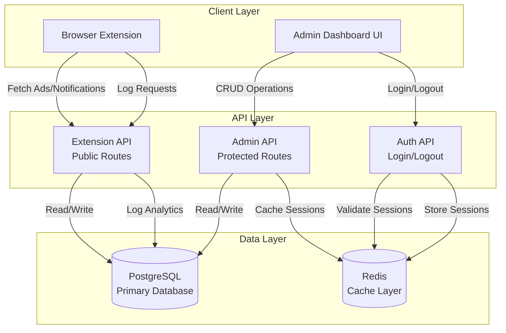
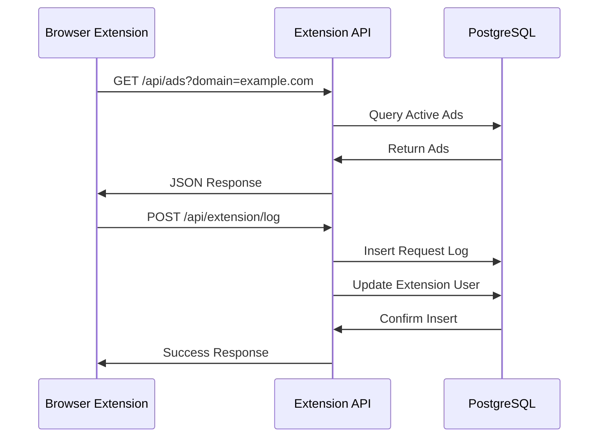

# System Architecture

## Overview

The Admin Dashboard is a Next.js 16 application that provides a complete backend and administrative interface for managing advertisements and notifications delivered via browser extensions. The system follows a three-tier architecture with clear separation between client, API, and data layers.

## High-Level Architecture



## Component Architecture

### Application Layers

#### 1. Client Layer
- **Browser Extension**: Consumes public Extension API
- **Admin Dashboard**: React-based UI for content management
- **Components**: Reusable UI components built with shadcn/ui

#### 2. API Layer
- **Extension API** (`/api/ads`, `/api/notifications`, `/api/extension/log`)
  - Public endpoints (no authentication)
  - Domain-based filtering
  - Request logging for analytics
  
- **Admin API** (`/api/platforms`, `/api/ads`, `/api/notifications`)
  - Protected endpoints (require authentication)
  - Full CRUD operations
  - Admin-only access

- **Auth API** (`/api/auth/login`, `/api/auth/logout`)
  - Session management
  - JWT token generation/validation
  - Cookie-based authentication

#### 3. Data Layer
- **PostgreSQL**: Primary data store
  - Platforms, Ads, Notifications
  - Extension Users, Request Logs
  - Relationships and constraints

- **Redis**: Caching layer
  - Session storage
  - Potential for query caching

## Request Flow

### Admin Dashboard Request Flow


### Extension API Request Flow



## Data Flow

### Creating an Ad

1. **Admin Action**: Admin fills form in dashboard
2. **Client**: Form submission via POST to `/api/ads`
3. **API**: Validates input, checks authentication
4. **Database**: Inserts new ad record
5. **Response**: Returns created ad data
6. **Client**: Updates UI, redirects or shows success

### Extension Fetching Ads

1. **Extension**: Detects user on configured domain
2. **API Call**: GET `/api/ads?domain=example.com`
3. **Database**: Queries active ads for platform matching domain
4. **Response**: Returns array of active ads
5. **Extension**: Displays ads to user
6. **Logging**: Extension calls `/api/extension/log` to record request

## API Endpoints Summary

### Admin API (Protected - Requires Authentication)

#### Platforms
- `GET /api/platforms` - List all platforms
- `POST /api/platforms` - Create platform
- `GET /api/platforms/[id]` - Get platform details
- `PUT /api/platforms/[id]` - Update platform
- `DELETE /api/platforms/[id]` - Delete platform

#### Ads
- `GET /api/ads` - List all ads (admin view with platform info)
- `GET /api/ads?domain={domain}` - Get active ads for domain (extension use)
- `POST /api/ads` - Create ad
- `GET /api/ads/[id]` - Get ad details
- `PUT /api/ads/[id]` - Update ad
- `DELETE /api/ads/[id]` - Delete ad

#### Notifications
- `GET /api/notifications` - List all notifications (admin view)
- `GET /api/notifications?domain={domain}` - Get active notifications for domain
- `POST /api/notifications` - Create notification
- `GET /api/notifications/[id]` - Get notification details
- `PUT /api/notifications/[id]` - Update notification
- `DELETE /api/notifications/[id]` - Delete notification

### Extension API (Public - No Authentication)

- `GET /api/ads?domain={domain}` - Get active ads for domain
- `GET /api/notifications?domain={domain}` - Get active notifications for domain
- `POST /api/extension/log` - Log extension request (analytics)

### Authentication API

- `POST /api/auth/login` - Admin login (creates session)
- `POST /api/auth/logout` - Admin logout (destroys session)

## Design Patterns

### Server-Only Boundaries

Critical modules are marked as server-only to prevent accidental client-side usage:

```typescript
import 'server-only';
// Database, Redis, Auth, Config modules
```

### Singleton Pattern

Database and Redis connections use singleton pattern for efficiency:

```typescript
let db: ReturnType<typeof drizzle> | null = null;

function getDatabase() {
  if (db) return db;
  // Initialize once, reuse
  return db;
}
```

### Protected Routes

All routes under `/(protected)` require authentication:

```typescript
export default async function ProtectedLayout({ children }) {
  const session = await verifySession();
  if (!session) unauthorized();
  return <>{children}</>;
}
```

### Auto-Expiration

Ads automatically expire when end date passes:

```typescript
async function autoExpireAds() {
  await db.update(ads)
    .set({ status: 'expired' })
    .where(and(
      eq(ads.status, 'active'),
      lt(ads.endDate, now)
    ));
}
```

## Security Architecture

### Authentication Flow

1. Admin submits credentials via `/api/auth/login`
2. Server validates against environment variables
3. JWT token generated with 7-day expiration
4. Token stored in HTTP-only cookie
5. Subsequent requests include cookie automatically
6. Protected routes verify token before rendering

### Session Management

- **Storage**: HTTP-only cookies (not accessible via JavaScript)
- **Security**: Secure flag in production (HTTPS required)
- **Expiration**: 7 days from creation
- **Validation**: JWT signature verification on each request

### Data Protection

- **Input Validation**: Zod schemas for all inputs
- **Type Safety**: TypeScript strict mode
- **SQL Injection**: Type-safe queries via Drizzle ORM
- **XSS Protection**: React's built-in escaping
- **CSRF**: SameSite cookie attribute

## Performance Considerations

### Database Optimization

- Connection pooling (configurable via `DATABASE_POOL_MAX`)
- Efficient queries with proper joins
- Indexes on foreign keys and frequently queried fields
- Singleton pattern reduces connection overhead

### Caching Strategy

- Redis available for session storage
- Potential for query result caching
- Lazy initialization of Redis client

### Server Components

- Default to Server Components (no client JavaScript)
- Only use Client Components when interactivity needed
- Reduces bundle size and improves performance

## Deployment Architecture

### Development

- Docker Compose for PostgreSQL and Redis
- Next.js dev server with hot reload
- Local environment variables

### Production

- Next.js standalone build
- Database migrations before deployment
- Environment variables in production environment
- HTTPS required for secure cookies
- Connection pooling configured

## Extension Points

### Adding New Entities

1. Create schema in `src/db/schema/`
2. Export from `src/db/schema/index.ts`
3. Generate migration: `pnpm db:generate`
4. Create API routes in `src/app/api/`
5. Create admin pages in `src/app/(protected)/`
6. Add navigation in sidebar

### Adding New API Endpoints

1. Create route handler in `src/app/api/`
2. Follow existing patterns (error handling, validation)
3. Add to documentation
4. Update API summary if needed

### Extending Analytics

1. Add new fields to `request_logs` schema if needed
2. Update logging endpoint
3. Add analytics queries
4. Update dashboard UI

## Technology Stack

- **Framework**: Next.js 16 (App Router)
- **Language**: TypeScript (strict mode)
- **Database**: PostgreSQL
- **ORM**: Drizzle ORM
- **Cache**: Redis
- **UI**: React 19, Tailwind CSS 4, shadcn/ui
- **Auth**: JWT (Jose library)
- **Charts**: Recharts
- **Icons**: Tabler Icons

## Future Considerations

### Scalability

- Current architecture supports horizontal scaling
- Stateless API design
- Database connection pooling
- Redis for shared state

### Potential Enhancements

- API rate limiting
- Query result caching
- Background job processing
- Webhook support
- Real-time updates via WebSockets
