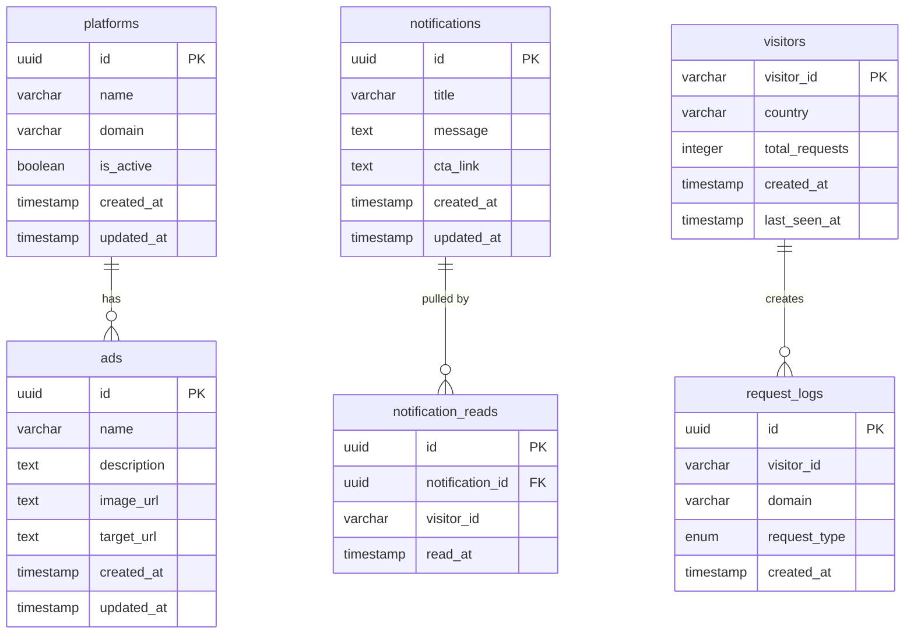

# Database Schema Documentation

## Overview

The database uses PostgreSQL with Drizzle ORM for type-safe database operations. The schema includes platforms, ads, notifications (global), notification_reads (per-user pull tracking), visitors (extension user tracking), request_logs (generic API request analytics), and campaign_logs (campaign-specific impressions).

## Entity Relationship Diagram



## Tables

### platforms

Stores platform/domain configurations where ads and notifications will be displayed.

| Column | Type | Constraints | Description |
|--------|------|------------|-------------|
| `id` | uuid | PRIMARY KEY, DEFAULT gen_random_uuid() | Unique platform identifier |
| `name` | varchar(255) | NOT NULL | Platform name (e.g., "Instagram", "Facebook") |
| `domain` | varchar(255) | NOT NULL | Domain URL (e.g., "https://www.instagram.com/") |
| `is_active` | boolean | NOT NULL, DEFAULT true | Whether platform is active |
| `created_at` | timestamp with time zone | NOT NULL, DEFAULT now() | Creation timestamp |
| `updated_at` | timestamp with time zone | NOT NULL, DEFAULT now() | Last update timestamp |

**Relationships:**
- One-to-many with `ads` (via `platform_id`)

**Indexes:**
- Primary key on `id`
- Unique constraint implied by primary key

**Usage:**
- Admin creates platforms to define where content will be shown
- Extension API uses domain to filter ads/notifications
- Platform can be activated/deactivated without deletion

---

### ads

Stores advertisement content with scheduling and platform association.

| Column | Type | Constraints | Description |
|--------|------|------------|-------------|
| `id` | uuid | PRIMARY KEY, DEFAULT gen_random_uuid() | Unique ad identifier |
| `name` | varchar(255) | NOT NULL | Ad name/title |
| `description` | text | NULL | Optional ad description |
| `image_url` | text | NULL | URL to ad image/banner |
| `target_url` | text | NULL | URL to redirect when ad is clicked |
| `platform_id` | uuid | FOREIGN KEY, NULL | Associated platform (null = all platforms) |
| `status` | enum | NOT NULL, DEFAULT 'inactive' | Ad status (see enum below) |
| `start_date` | timestamp with time zone | NULL | When ad becomes active |
| `end_date` | timestamp with time zone | NULL | When ad expires |
| `created_at` | timestamp with time zone | NOT NULL, DEFAULT now() | Creation timestamp |
| `updated_at` | timestamp with time zone | NOT NULL, DEFAULT now() | Last update timestamp |

**Status Enum Values:**
- `active` - Currently active and visible
- `inactive` - Manually deactivated
- `scheduled` - Scheduled for future activation
- `expired` - Automatically expired (end date passed)

**Relationships:**
- Many-to-one with `platforms` (via `platform_id`)
  - Foreign key with `ON DELETE SET NULL` (platform deletion doesn't delete ads)

**Indexes:**
- Primary key on `id`
- Foreign key index on `platform_id`

**Usage:**
- Admin creates ads with images and target URLs
- Ads can be scheduled with start/end dates
- Status automatically changes to 'expired' when end date passes
- Extension API returns only ads with `status = 'active'`

**Auto-Expiration:**
Ads with `status = 'active'` and `end_date < now()` are automatically updated to `status = 'expired'` when the dashboard loads.

---

### notifications

Stores notification messages with date ranges and multi-platform support.

| Column | Type | Constraints | Description |
|--------|------|------------|-------------|
| `id` | uuid | PRIMARY KEY, DEFAULT gen_random_uuid() | Unique notification identifier |
| `title` | varchar(255) | NOT NULL | Notification title |
| `message` | text | NOT NULL | Notification message content |
| `start_date` | timestamp with time zone | NOT NULL | When notification becomes active |
| `end_date` | timestamp with time zone | NOT NULL | When notification expires |
| `is_read` | boolean | NOT NULL, DEFAULT false | Read status (admin use) |
| `created_at` | timestamp with time zone | NOT NULL, DEFAULT now() | Creation timestamp |
| `updated_at` | timestamp with time zone | NOT NULL, DEFAULT now() | Last update timestamp |

**Relationships:**
- One-to-many with `notification_reads` (via `notification_id`)

**Indexes:**
- Primary key on `id`

**Usage:**
- Admin creates notifications with messages and date ranges (global; no domain/platform link)
- Extension API returns active notifications (where `start_date <= now() <= end_date`) that this user has not yet pulled (see `notification_reads`)
- `is_read` flag for admin tracking (not used by extension)

**Date filtering:** Only notifications where the current time is between `start_date` and `end_date` are considered active.

---

### notification_reads

Tracks which notifications each user has already pulled (so each notification is shown only once per user).

| Column | Type | Constraints | Description |
|--------|------|------------|-------------|
| `id` | uuid | PRIMARY KEY, DEFAULT gen_random_uuid() | Unique record identifier |
| `notification_id` | uuid | NOT NULL, FOREIGN KEY | Notification reference |
| `visitor_id` | varchar(255) | NOT NULL | Extension-provided user ID (same as in request body) |
| `read_at` | timestamp with time zone | NOT NULL, DEFAULT now() | When the user pulled this notification |

**Relationships:**
- Many-to-one with `notifications` (via `notification_id`), ON DELETE CASCADE

**Unique constraint:** `(notification_id, visitor_id)` — one row per user per notification.

**Usage:**
- When the extension calls the API with `requestType: "notification"` (or omits it), the API returns only active notifications that have no row in `notification_reads` for that `visitorId`
- After returning notifications, the API inserts rows into `notification_reads` so they are not returned again for that user

---

### visitors

Tracks browser extension users and their activity statistics.

| Column | Type | Constraints | Description |
|--------|------|------------|-------------|
| `visitor_id` | varchar(255) | PRIMARY KEY | Extension-provided visitor identifier |
| `country` | varchar(2) | NULL | 2-letter country code (from headers or body) |
| `total_requests` | integer | NOT NULL, DEFAULT 0 | Total number of API requests made |
| `created_at` | timestamp with time zone | NOT NULL, DEFAULT now() | First request timestamp |
| `last_seen_at` | timestamp with time zone | NOT NULL, DEFAULT now() | Most recent request timestamp |

**Relationships:**
- One-to-many with `request_logs` (via `visitor_id`, logical relationship)

**Indexes:**
- Primary key on `visitor_id`

**Usage:**
- Created automatically when extension calls any extension API
- Updated on each request (increments `total_requests`, updates `last_seen_at`)
- Used for analytics and user tracking
- `visitor_id` is provided by extension (fingerprint/hash)

**Upsert Behavior:**
When extension calls `/api/extension/ad-block` or `/api/extension/notifications`:
1. If `visitor_id` exists: Update `last_seen_at`, increment `total_requests`
2. If `visitor_id` doesn't exist: Create new record with `total_requests = 1`

---

### request_logs

Logs individual extension API requests for analytics purposes. Separate from `campaign_logs`, which tracks campaign-specific impressions.

| Column | Type | Constraints | Description |
|--------|------|------------|-------------|
| `id` | uuid | PRIMARY KEY, DEFAULT gen_random_uuid() | Unique log entry identifier |
| `visitor_id` | varchar(255) | NOT NULL | Extension user identifier |
| `domain` | varchar(255) | NOT NULL | Domain where request originated (use `extension` for notifications-only endpoint) |
| `request_type` | enum | NOT NULL | Type of request (see enum below) |
| `created_at` | timestamp with time zone | NOT NULL, DEFAULT now() | Request timestamp |

**Request Type Enum Values:**
- `ad` - Request for ads
- `notification` - Request for notifications

**Relationships:**
- Many-to-one with `visitors` (via `visitor_id`, logical relationship)

**Indexes:**
- Primary key on `id`
- Index on `(visitor_id, created_at DESC)` for efficient lookups

**Usage:**
- **User-guided logging**: Inserted only when the user actually receives data (ads or notifications)
- For ad-block: uses actual domain from request; inserts one row per type that returned data (ad, notification, or both)
- For notifications-only: uses sentinel domain `extension`; inserts only when notifications were returned
- Tracks which domains delivered content and request types (not every API call)
- Used for analytics dashboard

**Logging Flow:**
1. Extension calls `/api/extension/ad-block` or `/api/extension/notifications`
2. API upserts `visitors` record (increments `total_requests`)
3. API inserts `request_logs` **only when** ads or notifications were actually returned to the user

---

## Enums

### ad_status

Ad status enumeration.

- `active` - Ad is currently active and visible
- `inactive` - Ad is manually deactivated
- `scheduled` - Ad is scheduled for future activation
- `expired` - Ad has expired (end date passed)

**Default:** `inactive`

**Status Transitions:**
- Created → `inactive` (default)
- Admin activates → `active`
- Admin schedules → `scheduled`
- End date passes → `expired` (automatic)
- Admin deactivates → `inactive`

### request_type

Request type enumeration for analytics logging.

- `ad` - Extension requested ads
- `notification` - Extension requested notifications

**Usage:**
- Used in `request_logs` table
- Allows filtering analytics by request type
- Extension logs both types when fetching content

---

## Relationships Summary

### One-to-Many

1. **platforms → ads**
   - One platform can have many ads
   - Ad can belong to one platform (or null for all platforms)
   - Foreign key: `ads.platform_id` → `platforms.id`
   - On delete: SET NULL (platform deletion doesn't delete ads)

2. **visitors → request_logs** (logical)
   - One visitor can have many request logs
   - Logs reference visitor via `visitor_id` (varchar, not FK)
   - No foreign key constraint (flexibility for extension-provided IDs)

### Notification Read Tracking

1. **notifications → notification_reads**
   - Notifications are global (no platform link)
   - `notification_reads` tracks which notifications each user (by `visitor_id`) has already pulled
   - Unique on `(notification_id, visitor_id)`; foreign key `notification_id` → `notifications.id` ON DELETE CASCADE

---

## Indexes

### Primary Keys
- All tables have UUID primary keys
- Auto-generated using `gen_random_uuid()`

### Foreign Keys
- `ads.platform_id` → `platforms.id`
- `notification_reads.notification_id` → `notifications.id` (ON DELETE CASCADE)

### Unique Constraints
- `visitors.visitor_id` (primary key)
- `notification_reads (notification_id, visitor_id)` (unique)

### Implicit Indexes
- Foreign keys are automatically indexed
- Primary keys are automatically indexed

---

## Data Types

### UUID
- Used for all primary keys
- Generated automatically
- Type-safe in TypeScript via Drizzle

### Timestamps
- All timestamps use `timestamp with time zone`
- Default to `now()` for creation timestamps
- Updated manually for `updated_at` fields

### Text Fields
- `varchar(255)` for short text (names, titles, domains)
- `text` for longer content (descriptions, messages, URLs)
- No length limits on `text` fields

### Enums
- PostgreSQL native enums
- Type-safe in TypeScript
- Defined in Drizzle schema files

---

## Migration Management

### Generating Migrations

```bash
pnpm db:generate
```

Creates migration files in `drizzle/migrations/` based on schema changes.

### Applying Migrations

```bash
pnpm db:migrate
```

Applies pending migrations to the database.

### Development Shortcut

```bash
pnpm db:push
```

Pushes schema directly to database (dev only, not for production).

### Viewing Database

```bash
pnpm db:studio
```

Opens Drizzle Studio for visual database inspection.

---

## Query Patterns

### Fetching Active Ads for Domain

```typescript
// Find platform by domain
const [platform] = await db
  .select()
  .from(platforms)
  .where(eq(platforms.domain, domain))
  .limit(1);

// Get active ads for platform
const activeAds = await db
  .select()
  .from(ads)
  .where(
    and(
      eq(ads.platformId, platform.id),
      eq(ads.status, 'active')
    )
  );
```

### Fetching Active Notifications Not Yet Pulled by User

```typescript
// Get active notifications that this visitor has not yet pulled.
// Date filtering lives on campaigns; join notifications → campaignNotification → campaigns.
const activeNotifications = await db
  .select({
    id: notifications.id,
    title: notifications.title,
    message: notifications.message,
  })
  .from(notifications)
  .innerJoin(campaignNotification, eq(campaignNotification.notificationId, notifications.id))
  .innerJoin(campaigns, eq(campaigns.id, campaignNotification.campaignId))
  .leftJoin(
    notificationReads,
    and(
      eq(notificationReads.notificationId, notifications.id),
      eq(notificationReads.visitorId, visitorId)
    )
  )
  .where(
    and(
      isNull(notificationReads.id),
      eq(campaigns.status, 'active'),
      or(isNull(campaigns.startDate), lte(campaigns.startDate, now)),
      or(isNull(campaigns.endDate), gte(campaigns.endDate, now))
    )
  );
```

### Upserting Visitor (Extension User)

```typescript
await db
  .insert(visitors)
  .values({
    visitorId,
    country: resolvedCountry,
    totalRequests: 1,
    createdAt: now,
    lastSeenAt: now,
  })
  .onConflictDoUpdate({
    target: visitors.visitorId,
    set: {
      lastSeenAt: now,
      totalRequests: sql`${visitors.totalRequests} + 1`,
      ...(resolvedCountry !== null && { country: resolvedCountry }),
    },
  });
```

---

## Best Practices

1. **Always use migrations** for schema changes in production
2. **Use type-safe queries** via Drizzle ORM
3. **Validate input** before database operations
4. **Handle relationships** properly (cascade vs set null)
5. **Index foreign keys** (automatic in PostgreSQL)
6. **Use transactions** for multi-step operations when needed
7. **Set appropriate defaults** for timestamps and status fields
8. **Consider time zones** for date comparisons

---

## Future Considerations

### Potential Enhancements
- Add indexes on frequently queried fields (domain, status, dates)
- Add soft delete pattern (deleted_at timestamp)
- Add versioning/audit trail for content changes
- Add full-text search indexes for descriptions/messages
- Consider partitioning for large `request_logs` table
