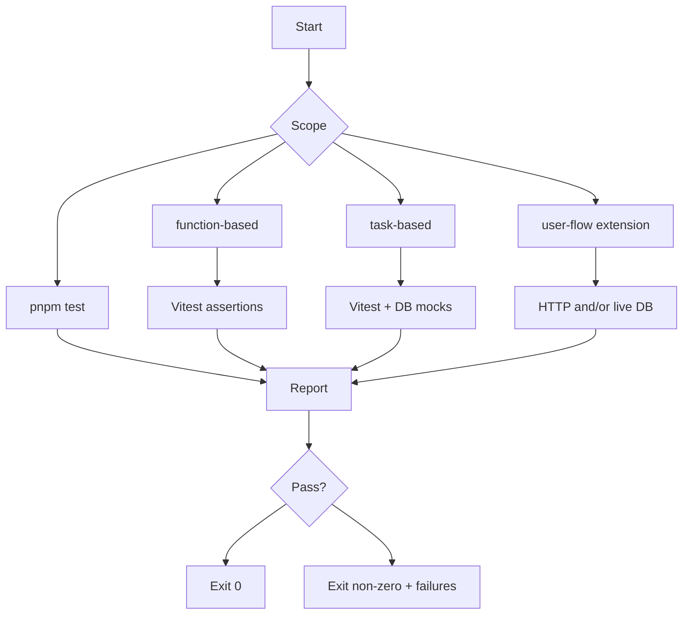

# Tests overview

Vitest runs in **Node**. Config: [`vitest.config.ts`](../vitest.config.ts) (loads `.env` then `.env.local`). Alias `@/` → `src/`, `server-only` → `tests/mocks/server-only.ts`.

## Layout

| Category | Path | Role |
|----------|------|------|
| Function-based pure/util | [`function-based/`](./function-based/) | No HTTP/DB; env stubs or pure inputs |
| Task-based rules | [`task-based/`](./task-based/) | Business rules with mocked DB |
| User flows | [`user-flow/`](./user-flow/) | Real HTTP and/or DB (opt-in) |
| Shared helpers | [`support/`](./support/) | Base URL resolution, test constants |
| Mocks | [`mocks/`](./mocks/) | e.g. `server-only` shim |

## npm scripts

| Command | What runs |
|---------|-----------|
| `pnpm test` / `npm test` | All `*.test.ts` under `tests/` |
| `pnpm test:unit` | Task-based auth scope only |
| `pnpm test:extension` | Extension campaign qualify (function-based) |
| `pnpm test:integration` | All extension integration files under [`user-flow/extension/`](./user-flow/extension/) |
| `pnpm test:watch` | Vitest watch mode |
| `pnpm test:extension-log` | Shell: [`docs/test-extension-log.sh`](../docs/test-extension-log.sh) |

Verbose output example: `pnpm test -- --reporter=verbose`

## Flow (how runs group)

## Docs per category

- [`function-based/README.md`](./function-based/README.md)
- [`task-based/README.md`](./task-based/README.md)
- [`user-flow/README.md`](./user-flow/README.md)
