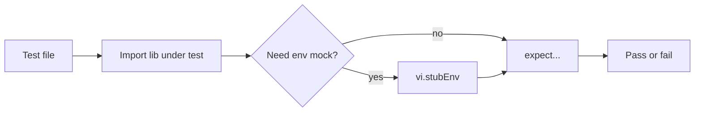

# Function-based tests

Pure functions, URL/env resolution, and parsing logic. **No** live HTTP or database (except what imported modules might do at import-time; these files are written to stay local).

## Files

| File | What it validates |
|------|-------------------|
| `extension-user-subscription.test.ts` | Subscription date helpers in `@/lib/extension-user-subscription` (trial/paid windows, env `DEFAULT_PAID_SUBSCRIPTION_DAYS`). |
| `extension-test-base-url.test.ts` | `extensionIntegrationBaseUrl()` in [`../support/extension-test-base-url.ts`](../support/extension-test-base-url.ts) — env precedence, trailing slashes, empty when integration flag off. |
| `extension-ad-block-qualify.test.ts` | Campaign qualification helpers in `@/lib/extension-ad-block-qualify` (schedule, audience, frequency, time, country, parsing). |
| `end-users-dashboard-filters.test.ts` | Filter parsing and chip labels for end-user dashboard (`@/lib/end-users-dashboard` with mocked `@/db`). |

## How to run

```bash
pnpm vitest run tests/function-based/
```

Single file:

```bash
pnpm vitest run tests/function-based/extension-ad-block-qualify.test.ts
```

Same as `pnpm test:extension` for the qualify suite only.

## Expected output

- Vitest **Test Files** / **Tests** counts; all **PASS** for exit code 0.
- Failures show file, test name, and assertion diff.

## Typical failures

- Time-sensitive tests if system date or logic around “today” drifts (qualify tests use `new Date()` in places).
- Env leakage between tests — mitigated by `afterEach` / `vi.unstubAllEnvs()` where used.

## Flow


