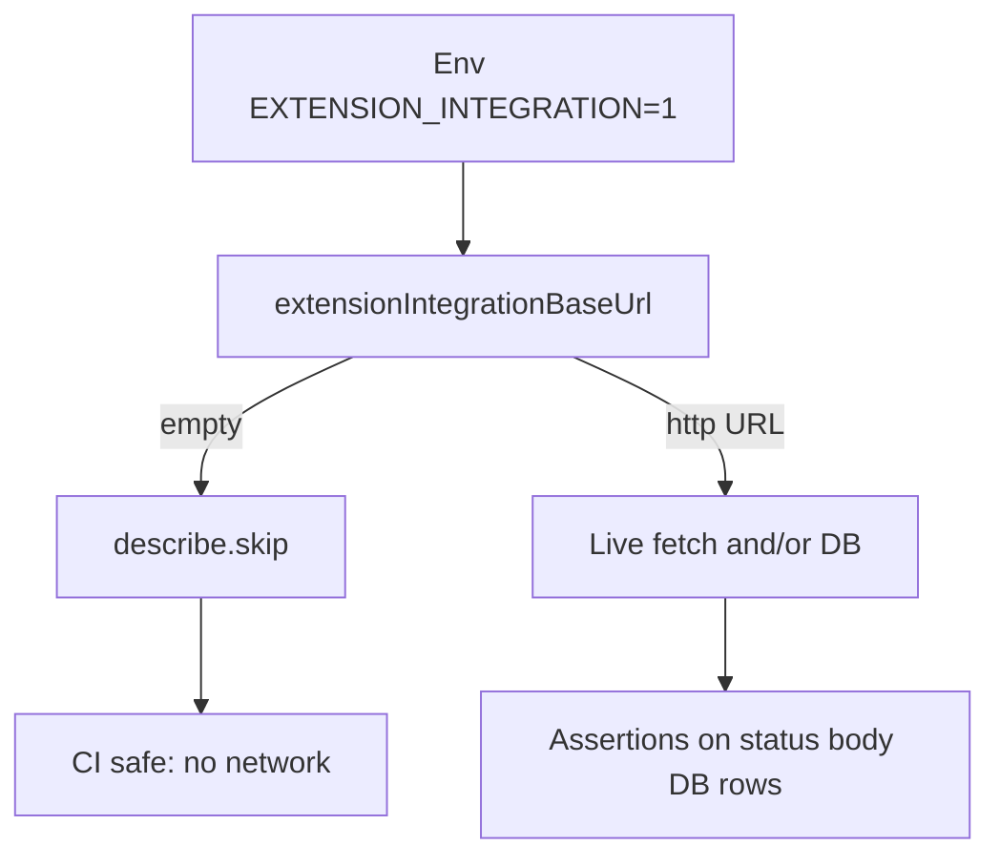

# User-flow tests

End-to-end style checks against a **running app** and/or **real database**. They are **skipped** unless integration env flags and base URLs are set (see [`../support/extension-test-base-url.ts`](../support/extension-test-base-url.ts)).

## Subfolders

- **[`extension/`](./extension/)** — Extension API HTTP flows and DB-heavy extension scenarios.

## Opt-in env

Set one of:

- `EXTENSION_INTEGRATION=1` (used by `pnpm test:integration`), or
- `EXTENSION_INTEGRATION_RUN=1`

And provide a reachable base URL via `EXTENSION_INTEGRATION_BASE_URL`, or `BETTER_AUTH_BASE_URL`, or `BETTER_AUTH_URL`.

`pnpm test` (no flag) keeps integration suites skipped when `extensionIntegrationBaseUrl()` returns `''`.

## How to run extension flows

```bash
pnpm test:integration
```

Runs every `*.test.ts` under `tests/user-flow/extension/`.

## Flow


