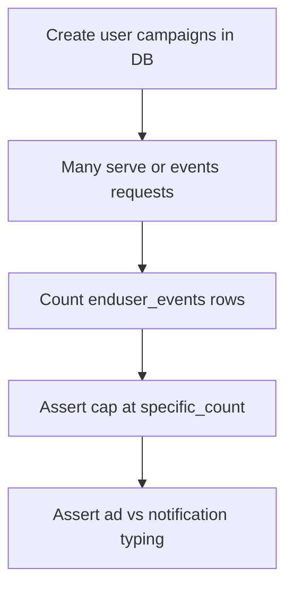

# Extension user-flow tests

Integration tests for the **extension** v2 surface: `live` (SSE), `serve`, `events`, register/login, campaign frequency caps, and event typing in the database. Legacy `GET /api/extension/domains` and `POST /api/extension/ad-block` are removed; the old `extension-user-flow` suite was removed.

## Files

| File | What it validates |
|------|-------------------|
| `extension-event-types-frequency.integration.test.ts` | Creates campaigns, uses v2 `serve` / `events` flows, asserts per-campaign caps and `enduser_events` row types/counts via Drizzle + live DB. |
| `extension-multi-user-frequency-load.integration.test.ts` | 10 users × 15 requests per campaign type (`ads`, `popup`, `notification`, `redirect`), asserts per-user `specific_count` cap and DB event rows; runs types sequentially. |
| `extension-sse-live-connection.integration.test.ts` | SSE `GET /api/extension/live` first event shape and stream behavior. |
| `extension-auth-anonymous-merge.integration.test.ts` | Extension auth + anonymous user merge behavior (opt-in). |
| `extension-v2-http.integration.test.ts` | v2: `GET /live` (first SSE `init`), `POST /serve`, `POST /events` validation and auth. |

## Prerequisites

- `EXTENSION_INTEGRATION=1` or `EXTENSION_INTEGRATION_RUN=1`
- Base URL set (see [`../../support/extension-test-base-url.ts`](../../support/extension-test-base-url.ts))
- **Next app + DB running** and matching `DATABASE_URL` in env for the DB-heavy test

**Vitest runs test files sequentially** (`fileParallelism: false` in [`vitest.config.ts`](../../vitest.config.ts)). Extension suites reuse the same shared login emails and single-session tokens; running multiple integration files in parallel causes **401** and bogus frequency counts.

## How to run

All extension integration tests:

```bash
pnpm test:integration
```

Single file:

```bash
EXTENSION_INTEGRATION=1 pnpm vitest run tests/user-flow/extension/extension-v2-http.integration.test.ts
```

Multi-user frequency load only (long-running):

```bash
pnpm test:frequency-load
```

v2 endpoints only:

```bash
pnpm test:extension-v2
```

Verbose:

```bash
pnpm test:integration -- --reporter=verbose
```

## Expected output

- When base URL is unset: suites use `describe.skip` → Vitest reports **skipped** tests, still exit 0.
- When live: **PASS** with HTTP 200/201 and expected JSON/DB shapes; failures show response or query mismatch.

## Manual HTTP smoke test

[`docs/test-extension-log.sh`](../../../docs/test-extension-log.sh) — curl-style flow with `jq` (documented separately).

## Flow (v2 HTTP + SSE smoke)

- Register or login, open `GET /api/extension/live` (SSE) for `init` + domains/redirects, then `POST /api/extension/serve` and `POST /api/extension/events` as in `extension-v2-http.integration.test.ts`.

## Flow (frequency + DB suite)


